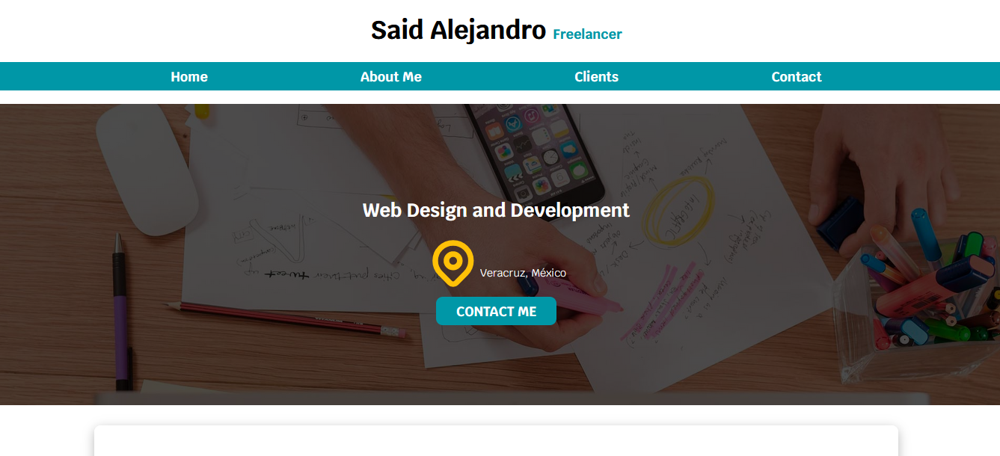
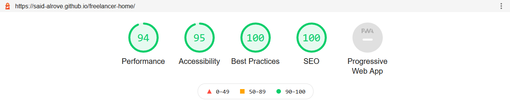
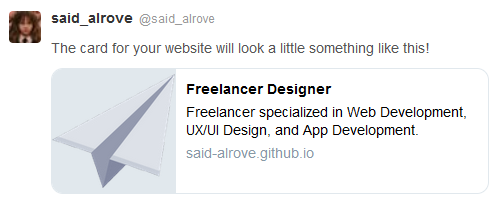

# freelancer-home
First project from Juan Pablo's course of Web Development.

## Project's preview

## What I learnt
How to use the [Open Graph Protocole](https://ogp.me/) ([Facebook](https://ahrefs.com/blog/open-graph-meta-tags/#:~:text=Open%20Graph%20meta%20tags%20are%20snippets%20of%20code,them%20in%20the%20%3Chead%3E%20section%20of%20a%20webpage.) and [Twitter](https://warfareplugins.com/open-graph-tags-twitter-cards-rich-pins/#:~:text=Twitter%20cards%20are%20pretty%20much%20exactly%20like%20Open,Cards%3A%20Title%2C%20description%2C%20thumbnail%2C%20and%20Twitter%20account%20attribution.))

### Lighthouse

### Open Graph Facebook

### Open Graph Twitter

